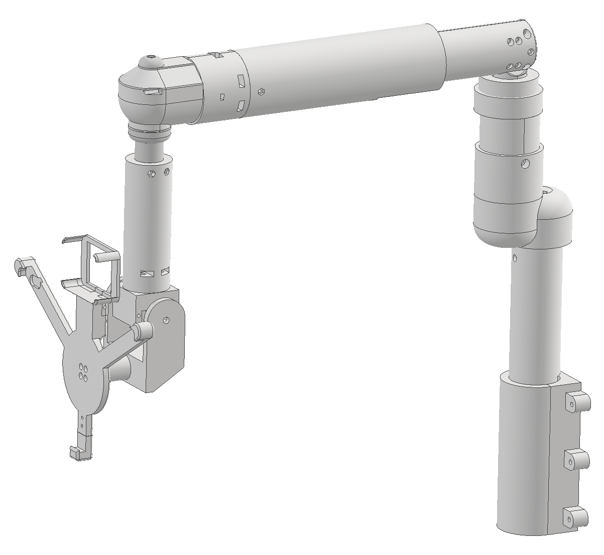
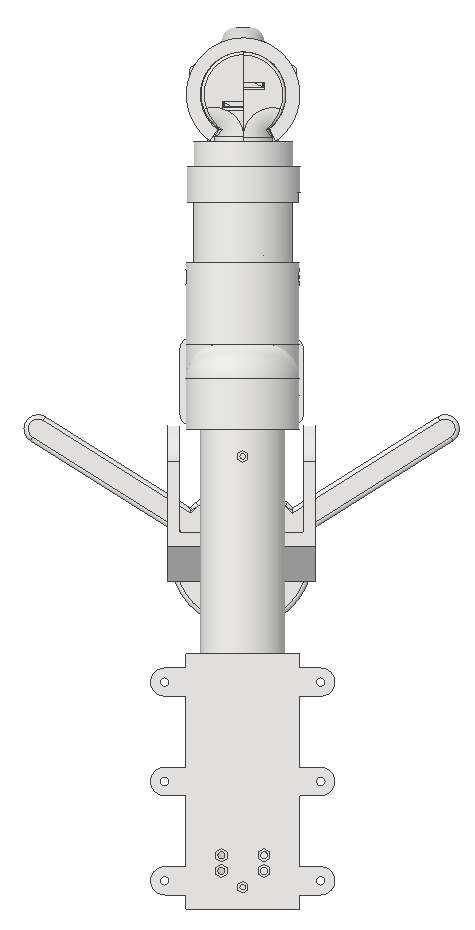

# 사용자 환경에 따른 자동 조절 모니터암

> AI Vision과 BLE 제어를 활용하여 사용자의 위치와 환경에 맞춰 모니터 위치를 조절할 수 있도록 제작한 기계공학 캡스톤디자인 프로젝트입니다.

---

## Project Overview

| 항목 | 내용 |
|---|---|
| 프로젝트명 | 사용자 환경에 따른 자동 조절 모니터암 |
| 수행기간 | 2025.03 ~ 2025.06 |
| 프로젝트 유형 | 기계공학 캡스톤디자인 / 메카트로닉스 |
| 역할 | 팀장 |
| 주요 분야 | 기구설계, 모터 제어, BLE 통신, AI Vision 기반 사용자 추적, 시제품 제작 |
| 설계 도구 | Autodesk Inventor |
| 제어보드 | Orange Board BLE |
| AI Vision | KOCOAFAB AI CocoCam |

---

## Project Summary

기존 모니터암은 사용자가 직접 위치와 각도를 조절해야 하기 때문에 거동이 불편한 사용자의 경우 반복적인 조작이 어렵다는 한계가 있습니다.

본 프로젝트에서는 전동 구동부와 BLE 제어, AI 기반 사용자 인식 기능을 결합하여 사용자가 원하는 위치로 모니터를 이동시키고, 저장된 위치로 자동 복귀하거나 사용자 위치를 인식해 자동으로 추적할 수 있는 모니터암을 제작했습니다.

주요 구현 기능은 다음과 같습니다.

- BLE 기반 수동 위치 제어
- 사용자 지정 위치 저장
- 저장 위치 자동 복귀
- AI 카메라 기반 사용자 얼굴 및 위치 인식
- 사용자 위치 변화에 따른 자동 추적
- 다축 구동이 가능한 모니터암 구조 설계
- 실제 시제품 제작 및 구동

---

## Problem Definition

일반적인 모니터암은 사용자가 직접 모니터의 위치와 각도를 조절해야 합니다.

이러한 구조는 일반적인 사용 환경에서는 큰 문제가 없지만, 거동이 불편한 사용자나 반복적인 자세 변경이 필요한 환경에서는 모니터 위치를 계속 직접 조정해야 하는 불편함이 발생할 수 있습니다.

프로젝트에서는 이러한 문제를 해결하기 위해 다음 두 가지 방향으로 접근했습니다.

1. 사용자가 직접 조작할 수 있는 BLE 기반 수동 제어 기능
2. 사용자 위치를 인식하여 모니터암이 자동으로 이동하는 자동 제어 기능

---

## Project Goals

- 스마트폰 또는 태블릿을 이용한 BLE 기반 모니터암 원격 제어
- 사용자가 지정한 모니터 위치 저장
- 저장된 위치로 자동 복귀하는 메모리 기능 구현
- AI 카메라를 이용한 사용자 얼굴 및 위치 인식
- 사용자 위치 변화에 따른 모니터암 자동 추적
- 전동 구동부를 적용한 다축 모니터암 제작
- 기구설계, 제어 및 시제품 제작을 하나의 시스템으로 통합

---

## System Configuration

### Controller

- Orange Board BLE
- BLE 통신 기반 사용자 입력 수신
- 각 구동부 제어
- 수동 및 자동 제어 로직 수행

### AI Vision

- KOCOAFAB AI CocoCam
- 사용자 얼굴 및 위치 인식
- 인식된 사용자 위치를 자동 제어에 활용

### Actuators

- HS-7950TH Servo Motor
- MG996R Servo Motor
- LMB2036U Linear Actuator
  - DC 6V / 12V
  - 최대 추력 60 N
  - Stroke 150 mm

### User Interface

- MIT App Inventor 기반 BLE 제어 애플리케이션
- 팀원과 공동 제작
- 모니터암 수동 조작에 활용

---

## System Flow

~~~text
[사용자]

   │
   ├── Manual Mode
   │      │
   │      ▼
   │   BLE Application
   │      │
   │      ▼
   │   Orange Board BLE
   │      │
   │      ▼
   │   Servo / Linear Actuator
   │
   └── Automatic Mode
          │
          ▼
      AI CocoCam
          │
          ▼
   사용자 얼굴/위치 인식
          │
          ▼
   Orange Board BLE
          │
          ▼
   Servo / Linear Actuator
          │
          ▼
      모니터 위치 조절
~~~

---

## Operating Modes

### 1. Manual Mode

MIT App Inventor 기반 BLE 애플리케이션을 이용하여 사용자가 모니터암의 위치를 직접 제어할 수 있도록 구현했습니다.

또한 자동차의 메모리 시트 기능에서 착안하여 사용자가 원하는 위치를 저장하고, 버튼 입력 시 저장된 위치로 다시 이동할 수 있도록 위치 저장 및 자동 복귀 기능을 구현했습니다.

주요 기능은 다음과 같습니다.

- BLE 기반 원격 제어
- 모니터암 위치 조절
- 사용자 지정 위치 저장
- 저장 위치 자동 복귀

▶ [Manual Mode Demo](03_demo/demo-manual-mode-optimized.mp4)

---

### 2. Automatic Mode

KOCOAFAB AI CocoCam을 이용하여 사용자의 얼굴과 위치를 인식하고, 사용자의 위치 변화에 따라 모니터암이 자동으로 움직이도록 제어 로직을 구현했습니다.

사용자가 모니터암을 반복적으로 직접 조작하지 않아도 사용자 위치에 맞춰 모니터가 이동할 수 있도록 구성했습니다.

주요 기능은 다음과 같습니다.

- AI 카메라 기반 사용자 얼굴 인식
- 사용자 위치 인식
- 사용자 위치 변화 감지
- 모니터암 자동 추적
- 구동부 자동 제어

▶ [Automatic Mode Demo](03_demo/demo-auto-mode-optimized.mp4)

---

## Mechanical Design

모니터암의 기구설계와 3D 모델링은 팀원들과 공동으로 수행했습니다.

Autodesk Inventor를 활용하여 전체 어셈블리와 각 구동부가 결합되는 구조를 모델링하고, 시제품 제작에 활용했습니다.

### Isometric View

---

### Front View

---

### Rear View

---

### Right View

---

### Section View

---

### Section Right View

---

## My Contribution

본 프로젝트에서 팀장을 맡아 전체 진행 상황과 역할을 조율했으며, 특히 수동 및 자동 제어 기능 구현을 중심으로 담당했습니다.

### 직접 수행 및 주도한 업무

- 프로젝트 팀장으로 일정 및 업무 진행 조율
- 수동 제어 로직 개발
- 자동 제어 로직 개발
- Orange Board BLE 기반 구동 제어
- AI CocoCam을 활용한 사용자 인식 기능 적용
- 사용자 위치에 따른 자동 추적 기능 구현
- 사용자 지정 위치 저장 기능 구현
- 저장 위치 자동 복귀 기능 구현

### 팀원과 공동 수행한 업무

- Autodesk Inventor 기반 기구설계
- 전체 어셈블리 3D 모델링
- MIT App Inventor 기반 BLE 제어 애플리케이션 제작
- 시제품 제작 및 조립

---

## Technologies / Engineering Skills

### Mechanical

- Autodesk Inventor
- Mechanical Design
- 3D Assembly Modeling
- Prototype Development
- Mechatronics

### Control / Embedded

- Orange Board BLE
- BLE Communication
- Servo Motor Control
- Linear Actuator Control
- Embedded Control

### Vision / Automation

- KOCOAFAB AI CocoCam
- AI Vision
- User Recognition
- User Position Tracking
- Automatic Position Control

### Project

- Team Leadership
- Project Coordination
- Hardware Integration
- Prototype Assembly

---

## Results

기계 구조설계, 전동 구동부, BLE 통신 및 AI 기반 사용자 인식 기능을 하나의 시제품으로 구성했습니다.

실제 시제품에서는 다음 기능의 작동을 확인했습니다.

- BLE 기반 수동 모니터 위치 제어
- 사용자 지정 위치 저장
- 저장된 위치로 자동 복귀
- AI 카메라 기반 사용자 얼굴 및 위치 인식
- 사용자 위치 변화에 따른 자동 추적
- Servo Motor 및 Linear Actuator 기반 모니터암 구동

프로젝트를 통해 기계 구조만 설계하는 데서 끝내지 않고, 제어 하드웨어와 사용자 인터페이스, AI Vision 기능을 결합하여 실제 작동 가능한 시제품까지 제작했습니다.

---

## Award

### 2025 H-BRIDGE 한남 공학페스티벌

- 종합설계 비IT분야 **대상**
- 본 캡스톤디자인 프로젝트를 통해 수상

---

## Related Intellectual Property

본 프로젝트에서 개발한 스마트 모니터암 기술은 이후 기술 구체화 및 기능 확장을 거쳐 관련 특허 출원으로 연결되었습니다.

### 1. 스마트 모니터암 시스템

- 발명의 명칭: **스마트 모니터암 시스템**
- 대한민국 특허출원
- 출원번호: **10-2026-0049869**
- 발명자 참여

캡스톤디자인에서 개발한 스마트 모니터암의 구조 및 제어 개념과 관련된 기술을 구체화한 특허입니다.

---

### 2. AI 인식 기반 자율 제어 기능의 지능형 모니터 암

- 발명의 명칭: **AI 인식 기반 자율 제어 기능의 지능형 모니터 암**
- 대한민국 특허출원
- 출원번호: **10-2026-0003663**
- 발명자 참여

기술 개발 흐름상 기존 스마트 모니터암을 기반으로 추가 인원이 참여하여 개발 범위를 확장했으며, AI 인식과 자율 제어 기능 등을 추가한 지능형 모니터암 기술로 발전시켰습니다.

---

## Repository Structure

~~~text
automatic-monitor-arm/
├── README.md
├── .gitignore
├── 01_overview/
│   └── project-overview.png
├── 02_design/
│   ├── assembly-front-view.png
│   ├── assembly-rear-view.png
│   ├── assembly-right-view.png
│   ├── assembly-section-view.png
│   ├── assembly-section-right-view.png
│   └── assembly-isometric-view.png
└── 03_demo/
    ├── demo-auto-mode-optimized.mp4
    └── demo-manual-mode-optimized.mp4
~~~

---

## Notes

본 Repository는 취업 포트폴리오 목적으로 프로젝트의 설계 과정, 구현 기능, 시제품 및 성과를 정리한 자료입니다.

팀 프로젝트 전체 결과와 개인 기여 범위를 구분하여 작성했으며, 실제 수행한 업무와 확인 가능한 프로젝트 결과를 중심으로 구성했습니다.